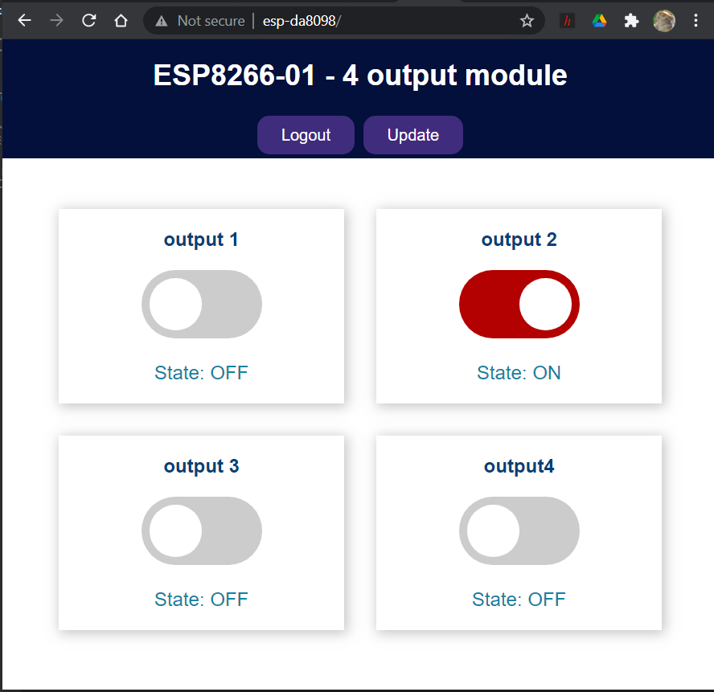

<h1>ESP8266_OTA-with-Arduino-IDE</h1>
<h2>Arduino IDE DEV platform with OTA based on ESP8266-01</h2>

Based on the popular esp8266-01 module ad arduino IDE, The idea is to make a programmable platform using the 4 gpio's as digital output/Input. It can be easily connected to any module like 4 relay module boards or anything needed to be driven by digital output.

Async web server and async web socket have been implemented as device dashboard and AsyncElegantOTA to upload the firmware and the FS data folder. A config.ini file is stored in the data folder for the device parameter. The web server html and css and js file are stored in the Data directory.

Just copy the ESP8266_OTA.ino file and the data folder to your arduino sketch folder. Modify your wifi credential in the sketch In the config.inifile modify <em><strong>username:admin, </strong></em><em><strong>password:12345</strong></em> To change the web server credential

The following libraries must be installed:

<ul>
<li><a href="https://github.com/me-no-dev/ESPAsyncTCP">ESPAsyncTCP</a></li>
<li>

<a href="https://github.com/me-no-dev/ESPAsyncWebServer">ESPAsyncWebServer</a>

</li>
<li><a href="https://github.com/earlephilhower/arduino-esp8266littlefs-plugin/releases">LittleFS </a></li>
<li><a href="https://arduinojson.org/">ArduinoJSON </a></li>
<li><a href="https://github.com/ayushsharma82/AsyncElegantOTA">AsyncElegantOTA</a></li>
</ul>
