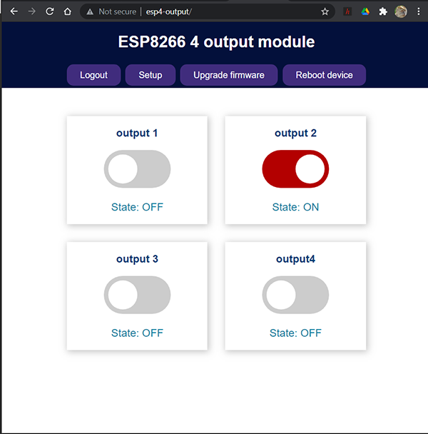
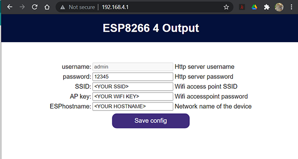
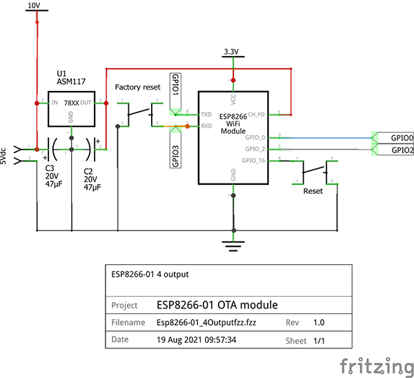
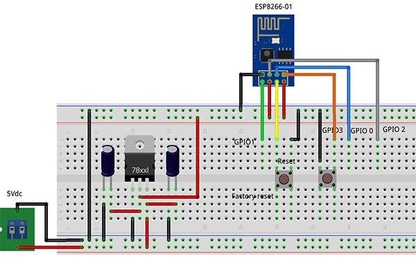
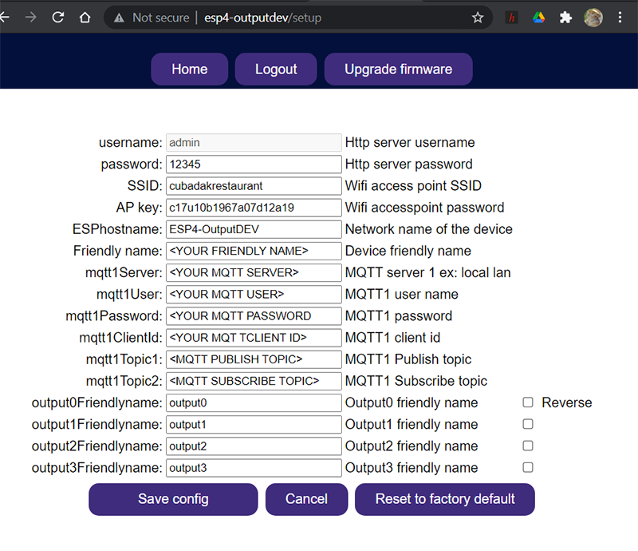
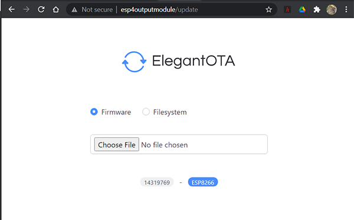
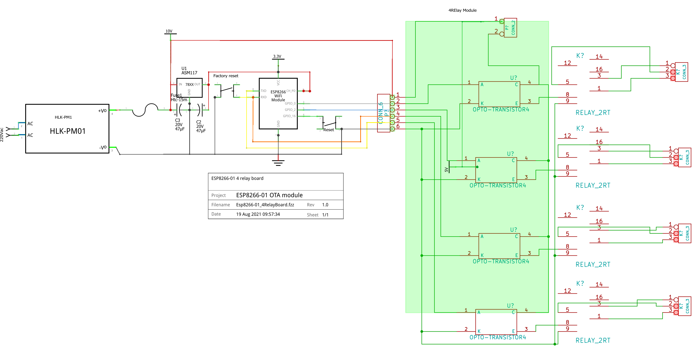
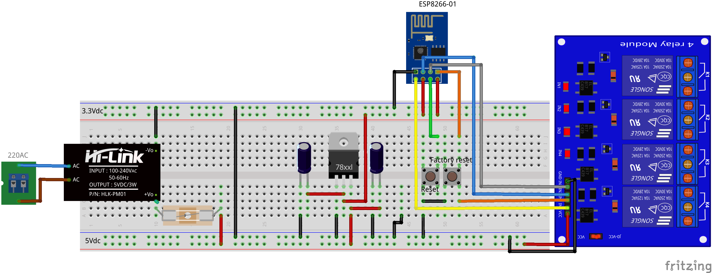

# ESP8266_4Output-OTA-MQTT-with-Arduino-IDE
## Arduino IDE DEV platform with OTA and MQTT based on ESP8266-01

Based on the popular esp8266-01 module ad arduino IDE,  
The idea is to make a programmable platform using the 4 gpio's as digital output/Input.  
It can be easily connected to any module like 4 relay module boards or anything needed to be driven by digital output.

The device can publish and subscribe to an MQTT broker to allow remote control of the module.

Async web server and async web socket have been implemented as device dashboard and AsyncElegantOTA to upload the firmware and the FS data folder.  
A config.json file is stored in the data folder for the device parameter.  
The web server html and css and js file are stored in the Data directory.

## Installation
Copy the following ino files **ESP8266_4output_OTA.ino**,  **LittleFS.ino**, **MQTT.ini**, **Webpage.ino**, **Webserver.ino** and the **data** folder to your Arduino sketch folder. 
Compile and Upload the sketch from Arduino IDE 
Upload the ***data*** folder with the ***[ESP8266 Little FS data upload](https://github.com/earlephilhower/arduino-esp8266littlefs-plugin)*** python script form the arduino IDE 

## Dependencies
The following libraries must be installed:

-   [ESPAsyncTCP](https://github.com/me-no-dev/ESPAsyncTCP)
-   [ESPAsyncWebServer](https://github.com/me-no-dev/ESPAsyncWebServer)
    
-   [LittleFS](https://github.com/earlephilhower/arduino-esp8266littlefs-plugin/releases)
-   [ArduinoJSON](https://arduinojson.org/)
-   [AsyncElegantOTA](https://github.com/ayushsharma82/AsyncElegantOTA)
- [Pub sub client Nick O'Leary](https://github.com/knolleary/pubsubclient)

# running the first time
When you power the device just after having uploaded the data folder the config.json file put the module in init=true state. That mean that the module bootup as an access point.
The access point name is by default ***Esp8266-4Output*** and the password is ***123456789*** you can modify this value to your taste by modifying the file /data/config.json

The username ***admin*** and the password ***12345*** are the default credential for the http authentication. You can't change the username but you can modify the password.
ESPHostname is the UNC name your device is going to be shown on your network.
Once you click on ***Save config*** button, the device wil reboot and switch in Wifi workstation.

# Electrical diagram

# Factory reset
A button switch is connected between GPIO3 and ground.
When the device boot up, is first setting the GPIO3 as input and GPIO1 as output (GPIO1 is connected to the internal blue led of the ESP8266-01 module) and immediately check if the GPIO3 is on LOW state. If Factory rest button is pressed during the boot up, the config.json value are reset to original values and the device enter in an infinite loop flashing the blue internal led every second. 
To factory rest the module, simply press the Factory resest button before powering up the device or press the reset button. The blue led should start to blink to inform you that the module as been rest to its default value. You just need to reset again to start the init process.

# Device setup

You can access the device setup by clicking on the Setup button on the main page.

The Friendly name is the device name displayed on the main page
mqtt1User, mqtt1Password, mqtt1ClientId, mqtt1Topic1, mqtt1Topic2 are the parameters needed to connect to your MQTT Broker.
the ***mqtt1Topic1*** is used by the device as publish channel and the ***mqtt1Topic2*** is used as subscribed channel.

You can reset the module to Factory default by clicking on the button ***Reset to factory default*** 

# MQTT flow
The MQTT flow is based on a json String formatted as follow:

   ***{"output0":"0","output1":"0","output2":"1","output3":"0"}***
   
"***output0***" value of the property represent the output state "*1"="ON" /"HIGH"* or *"0"="OFF"/"LOW"*

The module is publishing the output state via the json string formatted above on the mqtt1Topic1 every time any state of the 4 output is modified either by the web interface or via the MQTT subscribed channel.

It publishes the output state during startup, when the http default page have been open and on 1 minute regular bases.
The module listen to the  mqtt1Topic2 and is expecting the Json string as formatted above. It changes the output state according to the Json string.
 
 # Upgrading the firmware
 You can upgrade the firmware by clicking on the ***Upgrade firmware*** button either from the main page or form the setup page.

The module is using the beautifully made code form [AsyncElegantOTA](https://github.com/ayushsharma82/AsyncElegantOTA)

OTA (On The Air) is an Espressif SDK to allow you to upload the firmware or the Data partition from a WIFI connection.

Select the radio button Firmware or File system. Choose the bin file accordingly. 

Once the bin file has been updated the device will reboot and the OTA page show you a green text "Success" and a Back Button.

To go back to your home page you'll have to type it in your browser address bar.

To create the sketch bin file to be uploaded as firmware, go to the menu ***Sketch/Export compiled binary*** in your arduino IDE,
The arduino IDE will compile the sketch and store it as bin file inside your arduino sketch folder.

To create the bin file to be uploaded as filesystem without the module connected via USB go to the menu T***ools/ESP8266 LittleFS data upload*** Some error are going to be split out on the monitor, that is perfectly normal browse up in the monitor window to find a line looking like that:
[LittleFS] upload  : ***C:\Users\***YOURUSERNAME***\AppData\Local\Temp\******arduino_build_635734***/***ESP8266_4output_OTA.mklittlefs.bin***

browse to this folder and copy the bin file into your arduino sketch folder.

# Networking consideration
The code assume that you are using a DHCCP server on your main router on your network and expect to have an IP address automatically delivered by the DHCP server.

The Host name should be automatically read by you router. If you can't reach your device by its hostname you should connect to your main router and look for any new IP address given by the DHCP service.

I have try to use mDNS service to use the device with a .local name but i have very unreliable and mitigated result with the ESP8266 MCU.  It seem to work better with ESP32 MCU.

# config.json file
All the parameters are store in the file config.json store in the data partition.

    {    
    "init":true,
    "APname":"Esp8266-4Output",
    "APkey":"123456789",
    "ESPhostname":"<YOUR HOSTNAME>",
    "friendlyName":"<YOUR FRIENDLY NAME>",
    "SSID":"<YOUR SSID>",
    "wifikey":"<YOUR WIFI KEY>",
    "username":"admin",
    "password":"12345",
    "mqtt1Server":"<MQTT SERVER>",
    "mqtt1Port":1883,
    "mqtt1User" : "<MQTT USER>",
    "mqtt1Password":"<MQTT PASSWORD>",
    "mqtt1ClientId":"<MQTT CLIENT ID>",
    "mqtt1Topic1":"<MQTT PUBLISH TOPIC>",
    "mqtt1Topic2":"<MQTT SUBSCRIBE TOPIC>"
    }
The init field is selecting the device mode. 

True= device initialization, the device is set  in AP mode.

False= Device normal mode, the device start in wifi station mode and the device parameters are read and apply from the coinfig.json file.

# To do
I will improve the following in the future. 
						
 1. I	implementing my own OTA interface to be able to automatically redirect to the Home page after successful update 
 3. Pos	sibility to choose a Friendly name for the output in the setup page.
 4. Possibility to revert the output state 0 for HIGH" and 1 for "LOW"
 5. (ma		ybe) implementing TLS connection for the MQTT broker
 6. (mae) implementing HTTPS connection for the internal webserver.

# Alternate Diagram The 4 channel relay Module

 
<!--stackedit_data:
eyJoaXN0b3J5IjpbOTgyMDgzOTExLC0yMDg3NTYzMzBdfQ==
-->